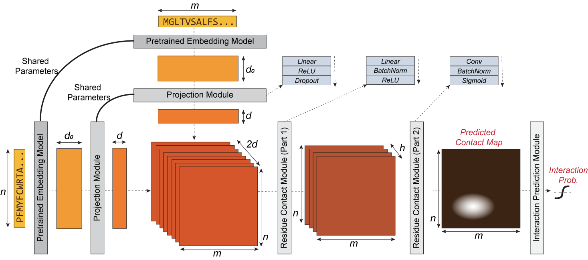

# D-SCRIPT
 

<!--- # --->
[](https://github.com/samsledje/D-SCRIPT/releases)
[](https://pypi.org/project/dscript/)
[](https://d-script.readthedocs.io/en/main/?badge=main)
[](https://github.com/samsledje/D-SCRIPT/blob/main/LICENSE)
[](https://github.com/psf/black)


 D-SCRIPT is a deep learning method for predicting a physical interaction between two proteins given just their sequences. It generalizes well to new species and is robust to limitations in training data size. Its design reflects the intuition that for two proteins to physically interact, a subset of amino acids from each protein should be in con-tact with the other. The intermediate stages of D-SCRIPT directly implement this intuition, with the penultimate stage in D-SCRIPT being a rough estimate of the inter-protein contact map of the protein dimer. This structurally-motivated design enhances the interpretability of the results and, since structure is more conserved evolutionarily than sequence, improves generalizability across species.

 - D-SCRIPT is described in the paper [“Sequence-based prediction of protein-protein interactions: a structure-aware interpretable deep learning model”](https://www.biorxiv.org/content/10.1101/2021.01.22.427866v1) by Sam Sledzieski, Rohit Singh, Lenore Cowen and Bonnie Berger.

 - [Homepage](http://dscript.csail.mit.edu)

 - [Documentation](https://d-script.readthedocs.io/en/main/)

 # Running Web Server

 - Navigate to `D-SCRIPT/server` and create the current dscript_web conda environment with

 ```
 $ conda env create -f web_environment.yml
 ```

 - Activate the created conda environment with

 ```
 $ conda activate dscript_web
 ```

- Build the front end:
```
$ cd frontend
$ npm install
$ npm run build
$ cd ..
```

- Run `redis-server` in a separate tab (note: should still run from the `server` directory and in the `dscript_web` environment).

- Run `celery -A server worker -l info` in a separate tab (same note as above)

- Launch the server with

```
$ python manage.py runserver
```

For development, the server can be access at `http://localhost:8000/`, and the admin panel at `http://localhost:8000/admin`.


########

## Docker

### Local Setup

1. Run
python manage.py runserver 0.0.0.0:8000
gunicorn -w 1 -b 0.0.0.0:80 server.wsgi
